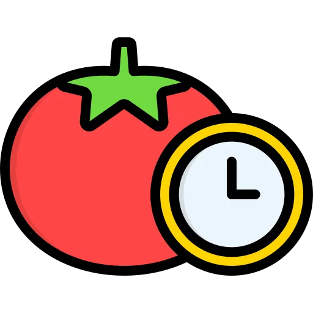

<!-- Improved compatibility of back to top link: See: https://github.com/othneildrew/Best-README-Template/pull/73 -->
<a id="readme-top"></a>
<!--
*** Thanks for checking out the Best-README-Template. If you have a suggestion
*** that would make this better, please fork the repo and create a pull request
*** or simply open an issue with the tag "enhancement".
*** Don't forget to give the project a star!
*** Thanks again! Now go create something AMAZING! :D
-->


<!-- PROJECT SHIELDS -->
<!--
*** I'm using markdown "reference style" links for readability.
*** Reference links are enclosed in brackets [ ] instead of parentheses ( ).
*** See the bottom of this document for the declaration of the reference variables
*** for contributors-url, forks-url, etc. This is an optional, concise syntax you may use.
*** https://www.markdownguide.org/basic-syntax/#reference-style-links
-->
[![Forks][forks-shield]][forks-url]
[![Stargazers][stars-shield]][stars-url]
[![Issues][issues-shield]][issues-url]
[![project_license][license-shield]][license-url]


<!-- PROJECT LOGO -->
<br />
<div align="center">
  <a href="https://github.com/Juicyyyyyyy/pomopensource">
    
  </a>

<h3 align="center">Pomopensource</h3>

  <p align="center">
    A cute pomodoro app giving you stats on how much time you worked
    <br />
    <a href="https://pomopensource.com"><strong>Try the website »</strong></a>
    <br />
    <br />
    <a href="https://github.com/Juicyyyyyyy/pomopensource">View Demo</a>
    ·
    <a href="https://github.com/Juicyyyyyyy/pomopensource/issues/new?labels=bug&template=bug-report---.md">Report Bug</a>
    ·
    <a href="https://github.com/Juicyyyyyyy/pomopensource/issues/new?labels=enhancement&template=feature-request---.md">Request Feature</a>
  </p>
</div>

<!-- TABLE OF CONTENTS -->
<details>
  <summary>Table of Contents</summary>
  <ol>
    <li>
      <a href="#about-the-project">About The Project</a>
      <ul>
        <li><a href="#built-with">Built With</a></li>
      </ul>
    </li>
    <li>
      <a href="#getting-started">Getting Started</a>
      <ul>
        <li><a href="#prerequisites">Prerequisites</a></li>
        <li><a href="#installation">Installation</a></li>
      </ul>
    </li>
    <li><a href="#license">License</a></li>
    <li><a href="#contact">Contact</a></li>
  </ol>
</details>

<!-- ABOUT THE PROJECT -->
## About The Project

<table>
  <tr>
    <td align="center" width="50%">
      <a href="/public/images/readme/home.webp"></a>
    </td>
    <td align="center" width="50%">
      <a href="/public/images/readme/calendar.webp"></a>
    </td>
  </tr>
  <tr>
    <td align="center" width="50%">
      <a href="/public/images/readme/settings.webp"></a>
    </td>
    <td align="center" width="50%">
      <a href="/public/images/readme/activity.webp"></a>
    </td>
  </tr>
</table>

Pomopopensource is a cute, minimalist, customizable webapp providing statistics on how much time you worked and on which subject. 

<p align="right">(<a href="#readme-top">back to top</a>)</p>

## Features 
- **Settings:**
    - Change the background
    - Adjust the duration of timers
    - Activate/desactivate alert sound, change sound, manage sound

- **Projects:**
  - Add and manage projects and subprojects to track your focus areas
  - Get detailed report summaries showing the time spent on each project and subproject
  - If no projects are created, all work hours will be categorized as "General Focus"

- **Stats:**
  - **Activity Summary**:
    - Track hours focused, days accessed, and your current day streak.
  - **Calendar Overview**:
    - Visualize your weekly, monthly, and yearly activity on a vibrant, interactive calendar.
  - **Detailed Reports**:
    - See how much time you’ve spent working on each project and subproject.


### Built With

* [![Vue][Vue.js]][Vue-url]
* [![Laravel][Laravel.com]][Laravel-url]

<p align="right">(<a href="#readme-top">back to top</a>)</p>

## Installing the Project

If you'd like to use the application directly, visit [pomopensource.com](https://pomopensource.com).

### Prerequisites

Ensure you have the following installed on your system:

- **Node.js** (npm included)
- **PHP**
- **Composer**
- **Laravel**

### Installation Steps

1. **Clone the repository**  
   ```bash
   git clone https://github.com/Juicyyyyyyy/pomopensource
   cd pomopensource
   ```

2. **Update dependencies**  
   Run the following command to install PHP dependencies:  
   ```bash
   composer update
   ```  

3. **Install JavaScript dependencies**  
   ```bash
   npm install
   ```

4. **Configure the environment**  
   Modify the `.env` file with your specific environment settings.

5. **Run database migrations**  
   ```bash
   php artisan migrate
   ```

6. **Seed the database**  
   Use the settings seeder to populate initial data:  
   ```bash
   php artisan db:seed --class=SettingsSeeder
   ```

### Running the Project

Start the development servers:  
- **Run frontend assets**:  
  ```bash
  npm run dev
  ```
- **Start the backend server**:  
  ```bash
  php artisan serve
  ```

<p align="right">(<a href="#readme-top">back to top</a>)</p>

<!-- LICENSE -->
## License

Distributed under the MIT License.

<p align="right">(<a href="#readme-top">back to top</a>)</p>


<!-- CONTACT -->
## Contact

You can contact me on discord, my id is: **juic_y**.

Project Link: [https://github.com/Juicyyyyyyy/pomopensource](https://github.com/Juicyyyyyyy/pomopensource)

<p align="right">(<a href="#readme-top">back to top</a>)</p>


<!-- MARKDOWN LINKS & IMAGES -->
<!-- https://www.markdownguide.org/basic-syntax/#reference-style-links -->
[contributors-shield]: https://img.shields.io/github/contributors/Juicyyyyyyy/pomopensource.svg?style=for-the-badge
[contributors-url]: https://github.com/Juicyyyyyyy/pomopensource/graphs/contributors
[forks-shield]: https://img.shields.io/github/forks/Juicyyyyyyy/pomopensource.svg?style=for-the-badge
[forks-url]: https://github.com/Juicyyyyyyy/pomopensource/network/members
[stars-shield]: https://img.shields.io/github/stars/Juicyyyyyyy/pomopensource.svg?style=for-the-badge
[stars-url]: https://github.com/Juicyyyyyyy/pomopensource/stargazers
[issues-shield]: https://img.shields.io/github/issues/Juicyyyyyyy/pomopensource.svg?style=for-the-badge
[issues-url]: https://github.com/Juicyyyyyyy/pomopensource/issues
[license-shield]: https://img.shields.io/github/license/Juicyyyyyyy/pomopensource.svg?style=for-the-badge
[license-url]: https://github.com/Juicyyyyyyy/pomopensource/blob/master/LICENSE
[linkedin-shield]: https://img.shields.io/badge/-LinkedIn-black.svg?style=for-the-badge&logo=linkedin&colorB=555
[linkedin-url]: https://linkedin.com/in/linkedin_username
[product-screenshot]: images/screenshot.png
[Next.js]: https://img.shields.io/badge/next.js-000000?style=for-the-badge&logo=nextdotjs&logoColor=white
[Next-url]: https://nextjs.org/
[React.js]: https://img.shields.io/badge/React-20232A?style=for-the-badge&logo=react&logoColor=61DAFB
[React-url]: https://reactjs.org/
[Vue.js]: https://img.shields.io/badge/Vue.js-35495E?style=for-the-badge&logo=vuedotjs&logoColor=4FC08D
[Vue-url]: https://vuejs.org/
[Angular.io]: https://img.shields.io/badge/Angular-DD0031?style=for-the-badge&logo=angular&logoColor=white
[Angular-url]: https://angular.io/
[Svelte.dev]: https://img.shields.io/badge/Svelte-4A4A55?style=for-the-badge&logo=svelte&logoColor=FF3E00
[Svelte-url]: https://svelte.dev/
[Laravel.com]: https://img.shields.io/badge/Laravel-FF2D20?style=for-the-badge&logo=laravel&logoColor=white
[Laravel-url]: https://laravel.com
[Bootstrap.com]: https://img.shields.io/badge/Bootstrap-563D7C?style=for-the-badge&logo=bootstrap&logoColor=white
[Bootstrap-url]: https://getbootstrap.com
[JQuery.com]: https://img.shields.io/badge/jQuery-0769AD?style=for-the-badge&logo=jquery&logoColor=white
[JQuery-url]: https://jquery.com 
