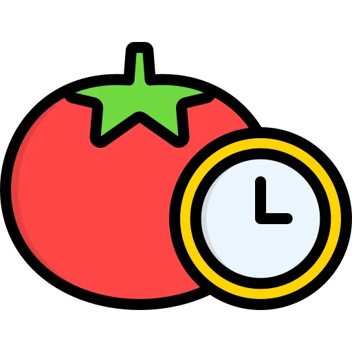

<!-- Improved compatibility of back to top link: See: https://github.com/othneildrew/Best-README-Template/pull/73 -->
<a id="readme-top"></a>
<!--
*** Thanks for checking out the Best-README-Template. If you have a suggestion
*** that would make this better, please fork the repo and create a pull request
*** or simply open an issue with the tag "enhancement".
*** Don't forget to give the project a star!
*** Thanks again! Now go create something AMAZING! :D
-->


<!-- PROJECT SHIELDS -->
<!--
*** I'm using markdown "reference style" links for readability.
*** Reference links are enclosed in brackets [ ] instead of parentheses ( ).
*** See the bottom of this document for the declaration of the reference variables
*** for contributors-url, forks-url, etc. This is an optional, concise syntax you may use.
*** https://www.markdownguide.org/basic-syntax/#reference-style-links
-->
[![Forks][forks-shield]][forks-url]
[![Stargazers][stars-shield]][stars-url]
[![Issues][issues-shield]][issues-url]
[![project_license][license-shield]][license-url]


<!-- PROJECT LOGO -->
<br />
<div align="center">
  <a href="https://github.com/Juicyyyyyyy/pomopensource">
    
  </a>

<h3 align="center">Pomopensource</h3>

  <p align="center">
    A cute pomodoro app giving you stats on how much time you worked
    <br />
    <a href="https://pomopensource.com"><strong>Try the website »</strong></a>
    <br />
    <br />
    <a href="https://github.com/Juicyyyyyyy/pomopensource">View Demo</a>
    ·
    <a href="https://github.com/Juicyyyyyyy/pomopensource/issues/new?labels=bug&template=bug-report---.md">Report Bug</a>
    ·
    <a href="https://github.com/Juicyyyyyyy/pomopensource/issues/new?labels=enhancement&template=feature-request---.md">Request Feature</a>
  </p>
</div>

<!-- TABLE OF CONTENTS -->
<details>
  <summary>Table of Contents</summary>
  <ol>
    <li>
      <a href="#about-the-project">About The Project</a>
      <ul>
        <li><a href="#built-with">Built With</a></li>
      </ul>
    </li>
    <li>
      <a href="#installing-the-project">Installing the Project</a>
      <ul>
        <li><a href="#option-1-helm-kubernetes">Option 1: Helm (Kubernetes)</a></li>
        <li><a href="#option-2-local-development">Option 2: Local Development</a></li>
      </ul>
    </li>
    <li><a href="#license">License</a></li>
    <li><a href="#contact">Contact</a></li>
  </ol>
</details>

<!-- ABOUT THE PROJECT -->
## About The Project

<table>
  <tr>
    <td align="center" width="50%">
      <a href="/public/images/readme/home.webp"></a>
    </td>
    <td align="center" width="50%">
      <a href="/public/images/readme/calendar.webp"></a>
    </td>
  </tr>
  <tr>
    <td align="center" width="50%">
      <a href="/public/images/readme/settings.webp"></a>
    </td>
    <td align="center" width="50%">
      <a href="/public/images/readme/activity.webp"></a>
    </td>
  </tr>
</table>

Pomopopensource is a cute, minimalist, customizable webapp providing statistics on how much time you worked and on which subject. 

<p align="right">(<a href="#readme-top">back to top</a>)</p>

## Features 
- **Settings:**
    - Change the background
    - Adjust the duration of timers
    - Activate/desactivate alert sound, change sound, manage sound

- **Projects:**
  - Add and manage projects and subprojects to track your focus areas
  - Get detailed report summaries showing the time spent on each project and subproject
  - If no projects are created, all work hours will be categorized as "General Focus"

- **Stats:**
  - **Activity Summary**:
    - Track hours focused, days accessed, and your current day streak.
  - **Calendar Overview**:
    - Visualize your weekly, monthly, and yearly activity on a vibrant, interactive calendar.
  - **Detailed Reports**:
    - See how much time you’ve spent working on each project and subproject.

- **Discord Activity:**
  - Run the timer inside a Discord voice channel, signed in with your Discord account
  - Everyone in the call shares one timer: anyone can start, pause or switch it, and each person's focus time is saved to their own account
  - See who else is in the session, and show it in your Discord status along with whether you're focusing or on a break, with a countdown
  - Picture-in-picture and grid views show the timer's name and progress


### Built With

* [![Vue][Vue.js]][Vue-url]
* [![Laravel][Laravel.com]][Laravel-url]

<p align="right">(<a href="#readme-top">back to top</a>)</p>

## Installing the Project

If you'd like to use the application directly, visit [pomopensource.com](https://pomopensource.com).

### Option 1: Helm (Kubernetes)

**Prerequisites:** a Kubernetes cluster with the [Gateway API CRDs](https://gateway-api.sigs.k8s.io/guides/#install-standard-channel) installed and a Gateway resource available.

1. **Clone the repository**
   ```bash
   git clone https://github.com/Juicyyyyyyy/pomopensource
   cd pomopensource
   ```

2. **Install chart dependencies**
   ```bash
   helm dependency update ./pomopensource
   ```

3. **Generate an application key**
   ```bash
   php artisan key:generate --show
   ```

4. **Install the chart**
   ```bash
   helm install pomopensource ./pomopensource \
     --set app.key=<your-app-key> \
     --set mysql.auth.password=<your-db-password>
   ```

   The chart will deploy the app and a MySQL instance. The container automatically runs migrations and seeds the database on startup, so no further setup is needed.

   **Optional overrides:**
   | Parameter | Description | Default |
   |-----------|-------------|---------|
   | `app.key` | Laravel application key (**required**) | — |
   | `mysql.auth.password` | MySQL password (**required**) | — |
   | `app.env` | Laravel environment | `production` |
   | `app.url` | Public URL of the app | `https://pomopensource.corentindupaigne.com` |
   | `hostname` | Hostname for the HTTPRoute | `pomopensource.corentindupaigne.com` |
   | `image.tag` | Docker image tag | `prod` |
   | `replicaCount` | Number of replicas | `1` |
   | `gateway.name` | Name of the Gateway resource | `gateway` |
   | `gateway.namespace` | Namespace of the Gateway resource | `default` |
   | `discord.clientId` | Discord application ID; enables the [Discord Activity](#running-as-a-discord-activity) | — |
   | `discord.existingSecret` | Secret holding the Discord client secret (required with `discord.clientId`) | — |
   | `discord.existingSecretKey` | Key of the client secret in that Secret | `DISCORD_CLIENT_SECRET` |

5. **Upgrade**
   ```bash
   helm upgrade pomopensource ./pomopensource \
     --set app.key=<your-app-key> \
     --set mysql.auth.password=<your-db-password>
   ```

6. **Uninstall**
   ```bash
   helm uninstall pomopensource
   ```

<p align="right">(<a href="#readme-top">back to top</a>)</p>

### Option 2: Local Development (Docker)

**Prerequisites:** Docker

1. **Clone the repository**
   ```bash
   git clone https://github.com/Juicyyyyyyy/pomopensource
   cd pomopensource
   ```

2. **Build the image**
   ```bash
   docker build -t pomopensource:prod .
   ```

3. **Run the container**
   ```bash
   docker run -p 8080:80 pomopensource:prod
   ```

   The app will be available at `http://localhost:8080`. Migrations and seeding run automatically on startup using SQLite.

<p align="right">(<a href="#readme-top">back to top</a>)</p>

### Running as a Discord Activity

Pomopensource can run inside Discord as an [Activity](https://docs.discord.com/developers/activities/overview). Users are signed in with their Discord account automatically, and their Discord status shows the timer.

1. **Create a Discord application** in the [Developer Portal](https://discord.com/developers/applications).
2. **OAuth2:** copy the **Client ID** and **Client Secret**, and add `https://127.0.0.1` as a redirect URI. Discord requires one, but Activities don't use it.
3. **Activities → URL Mappings:** map the root prefix `/` to your app's host without the scheme, e.g. `pomopensource.example.com`, and the prefix `/discord-cdn` to `cdn.discordapp.com` for avatars. Without the second mapping, avatars fall back to initials.
4. **Activities → Settings:** tick **Enable Activities**. This also creates the default Entry Point command used to launch it.
5. **Configure the deployment.** Store the client secret in a Kubernetes Secret and point the chart at it:
   ```bash
   kubectl create secret generic pomopensource-discord \
     --from-literal=DISCORD_CLIENT_SECRET=<client-secret>

   helm upgrade pomopensource ./pomopensource \
     --set discord.clientId=<client-id> \
     --set discord.existingSecret=pomopensource-discord
   ```
   This also switches session cookies to `SameSite=None; Secure; Partitioned`, which Discord's iframe requires. Without the chart, set these environment variables:
   ```dotenv
   DISCORD_CLIENT_ID=<client-id>
   DISCORD_CLIENT_SECRET=<client-secret>
   SESSION_SAME_SITE=none
   SESSION_SECURE_COOKIE=true
   SESSION_PARTITIONED_COOKIE=true
   ```
6. **Launch it** from a voice channel: open the Activities (rocket) menu and pick your application. Until the app is verified, only you and the users listed under **App Testers** can launch it.

The shared timer of each call is kept for a day after its last change; `php artisan schedule:run` (e.g. from cron) prunes older ones. If the browser blocks the session cookie anyway, the Activity still works on the device and shows **not synced** in its header.

For local development, expose the app over HTTPS with a tunnel (e.g. `cloudflared tunnel --url http://localhost:8080`) and use the tunnel's host as the URL mapping.

<p align="right">(<a href="#readme-top">back to top</a>)</p>

<!-- LICENSE -->
## License

Distributed under the MIT License.

<p align="right">(<a href="#readme-top">back to top</a>)</p>


<!-- CONTACT -->
## Contact

You can contact me on discord, my id is: **juic_y**.

Project Link: [https://github.com/Juicyyyyyyy/pomopensource](https://github.com/Juicyyyyyyy/pomopensource)

<p align="right">(<a href="#readme-top">back to top</a>)</p>


<!-- MARKDOWN LINKS & IMAGES -->
<!-- https://www.markdownguide.org/basic-syntax/#reference-style-links -->
[contributors-shield]: https://img.shields.io/github/contributors/Juicyyyyyyy/pomopensource.svg?style=for-the-badge
[contributors-url]: https://github.com/Juicyyyyyyy/pomopensource/graphs/contributors
[forks-shield]: https://img.shields.io/github/forks/Juicyyyyyyy/pomopensource.svg?style=for-the-badge
[forks-url]: https://github.com/Juicyyyyyyy/pomopensource/network/members
[stars-shield]: https://img.shields.io/github/stars/Juicyyyyyyy/pomopensource.svg?style=for-the-badge
[stars-url]: https://github.com/Juicyyyyyyy/pomopensource/stargazers
[issues-shield]: https://img.shields.io/github/issues/Juicyyyyyyy/pomopensource.svg?style=for-the-badge
[issues-url]: https://github.com/Juicyyyyyyy/pomopensource/issues
[license-shield]: https://img.shields.io/github/license/Juicyyyyyyy/pomopensource.svg?style=for-the-badge
[license-url]: https://github.com/Juicyyyyyyy/pomopensource/blob/master/LICENSE
[linkedin-shield]: https://img.shields.io/badge/-LinkedIn-black.svg?style=for-the-badge&logo=linkedin&colorB=555
[linkedin-url]: https://linkedin.com/in/linkedin_username
[product-screenshot]: images/screenshot.png
[Next.js]: https://img.shields.io/badge/next.js-000000?style=for-the-badge&logo=nextdotjs&logoColor=white
[Next-url]: https://nextjs.org/
[React.js]: https://img.shields.io/badge/React-20232A?style=for-the-badge&logo=react&logoColor=61DAFB
[React-url]: https://reactjs.org/
[Vue.js]: https://img.shields.io/badge/Vue.js-35495E?style=for-the-badge&logo=vuedotjs&logoColor=4FC08D
[Vue-url]: https://vuejs.org/
[Angular.io]: https://img.shields.io/badge/Angular-DD0031?style=for-the-badge&logo=angular&logoColor=white
[Angular-url]: https://angular.io/
[Svelte.dev]: https://img.shields.io/badge/Svelte-4A4A55?style=for-the-badge&logo=svelte&logoColor=FF3E00
[Svelte-url]: https://svelte.dev/
[Laravel.com]: https://img.shields.io/badge/Laravel-FF2D20?style=for-the-badge&logo=laravel&logoColor=white
[Laravel-url]: https://laravel.com
[Bootstrap.com]: https://img.shields.io/badge/Bootstrap-563D7C?style=for-the-badge&logo=bootstrap&logoColor=white
[Bootstrap-url]: https://getbootstrap.com
[JQuery.com]: https://img.shields.io/badge/jQuery-0769AD?style=for-the-badge&logo=jquery&logoColor=white
[JQuery-url]: https://jquery.com 
